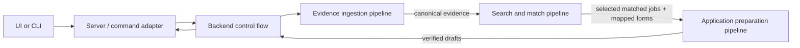

# Pipeline architecture

The product is three domain pipelines connected by backend control flow. A
pipeline owns transformation logic. The backend owns when a pipeline runs, where
artifacts are persisted, background progress, retries across user actions, and
movement of outputs into the next pipeline.



## Pipeline contract

Each big pipeline has:

- a top-level executable used by backend composition
  (`evidence-ingestion.ts`, `opportunity-researcher.ts`, or
  `application-preparation.ts`);
- domain and boundary contract files for values exchanged by its stages;
- numbered stage directories in execution order;
- a `README.md` describing invariants and failure boundaries.

No pipeline has a separate `pipeline.ts` manifest. Each README documents the
flow, numbered directories own the stages, the named top-level file exposes
production entry points, and `stage-registry.ts` describes standalone programs.

Each stage is classified as `deterministic`, `llm`, or `hybrid`. Model
boundaries live under that stage's `llm-calls/` directory. An individual
call owns its role prompt, input builder, output/schema, tools, memory policy,
runtime command, and static manifest.

## Control flow

`src/backend/control-flow/composition.ts` is the composition root shared by the
server, standalone stage runner, and live acceptance runner. `service.ts` persists the user
workspace and invokes pipeline entry points at explicit progress boundaries.
`stage-registry.ts` is the runnable stage registry. `stage-artifacts.ts` defines
the JSON envelope passed between standalone stage programs.

The normal composition is conceptually:

```ts
const evidence = await runEvidenceIngestion(sourceInput);
const jobs = await runSearchAndMatch(evidence);
const drafts = await runApplicationPreparation(selected(jobs));
```

HTTP and UI concerns do not appear in those pipeline inputs. The server maps
HTTP requests to control-flow commands; the UI only reads API state and sends
user commands.

## Model execution

Each model boundary starts a fresh `codex exec --ephemeral` process unless its
manifest explicitly declares a same-call retry. There is no hidden cross-call
chat memory. Each run records `prompt.txt`, `schema.json`, `result.json`,
`events.jsonl`, `stderr.log`, and `run.json` under `.agent-runtime/runs/`.

`src/backend/control-flow/llm-call-catalog.ts` lists every product LLM call.
`tests/pipeline-architecture.test.ts` verifies catalog uniqueness, folder/call
coverage, tool restrictions, and dependency direction.

### Role, skill, task, and gateway separation

Every LLM call has four deliberately separate instruction and enforcement
layers:

1. `role-prompt.ts` is a small immutable boundary: model identity, trust and
   tool policy, the operation it may perform, prohibited neighboring-stage
   behavior, grounding, and structured-output discipline.
2. The explicitly registered `.agents/skills/<name>/SKILL.md` contains the
   detailed procedure, domain rules, classifications, edge cases, and completion
   criteria. Skills cannot be invoked implicitly.
3. `input.ts` serializes only the current invocation's source data, prior output,
   findings, and bounded user instruction.
4. `output.ts` and the deterministic result gateway enforce structure and
   call-specific invariants after generation.

The runtime concatenates the role prompt, explicit `$skill` invocation,
prompt-only tool boundary, and task data before starting an ephemeral process.
Architecture tests cap role-prompt size and require every mapped skill to expose
separate `Procedure` and `Decision rules` sections, preventing detailed methods
from drifting back into role prompts.
