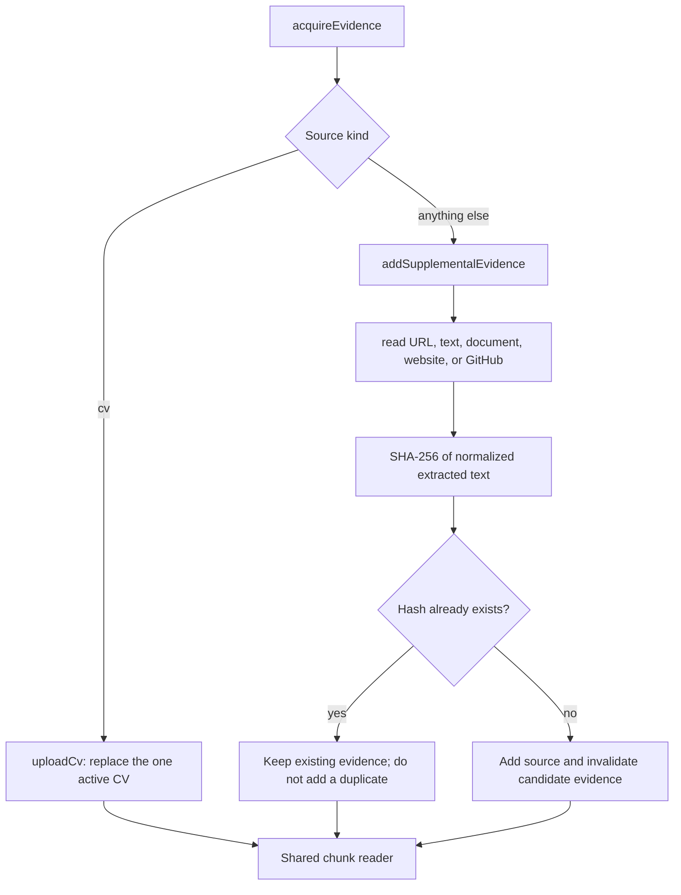

# Stage 01 — Evidence acquisition

[Back to Evidence Ingestion](../README.md) · [Executable flow](./flow.ts)

This is the single deterministic entry point for every candidate evidence
source. It finishes before the shared reader and synthesis LLM stages begin.

## Paths

| Source | Entry function | Rule |
|---|---|---|
| CV | `cv/upload-cv.ts` → `uploadCv()` | Replace the existing CV; no hash |
| Supplemental evidence | `additional-evidence/add-evidence.ts` → `addSupplementalEvidence()` | Add unless its content hash already exists |
| Text/file/URL acquisition | `additional-evidence/read-source.ts` → `readSupplementalEvidence()` | Return normalized text and its hash |

The hash is not a source version and does not affect CV ingestion. Its only
purpose is supplemental-evidence duplicate prevention.
