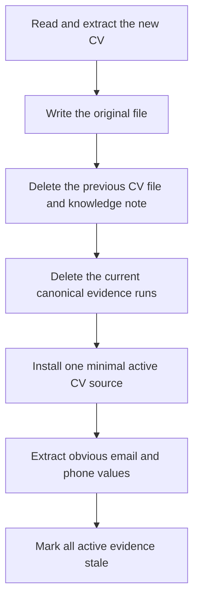

# Stage 01a — CV replacement

[Back to Evidence Acquisition](../README.md) · [Implementation](./upload-cv.ts)

This stage accepts a CV deterministically. It does not call an LLM. Its job is
to leave the workspace with exactly one active CV and no evidence that still
depends on the previous CV.

## Entry point

`uploadCv(dataRoot, workspace, input)`

`input` contains the displayed filename and either uploaded base64 data or
already decoded plain text. The function mutates and returns the supplied
candidate workspace.

## Internal flow

1. Read the new CV before touching the old one, so a bad upload cannot destroy
   the usable CV.
2. Save the original bytes under `job-search/files/<candidate-id>/`.
3. Remove every prior CV source, its original file, and its generated knowledge
   note.
4. Remove candidate evidence runs because they may contain claims from the old
   CV.
5. Add a deliberately small `CandidateSource`: id, kind, name, extracted text,
   original filename, processing state, and timestamp.
6. Fill email and phone only when the profile value is currently empty.
7. Set intelligence to `analyzing` so the queued reader flow can rebuild the
   complete evidence model.

## Output

- The workspace contains exactly one source with `kind: "cv"`.
- `workspace.finalCv` contains extracted CV text.
- CV-derived insights, knowledge, and canonical evidence are gone.
- Every readable active source is marked `analysisRequired`.
- No MIME type, byte size, hash, parser version, or CV source version is stored
  in the active CV record.

## Failure behavior

Unreadable, empty, oversized, or unsupported documents throw before the
existing CV is removed. The HTTP layer reports the error and does not queue the
background stages.

## Next stage

The endpoint saves this workspace, returns HTTP 202, and queues
[02 — Chunk Reader](../../02-chunk-reader/README.md).
