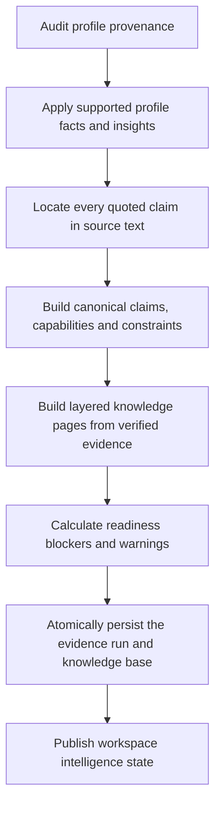

# 04 — Evidence verification and persistence

[Back to Evidence Ingestion](../README.md) · [Stage implementation](./index.ts) ·
[Canonical model implementation](./evidence-model.ts) ·
[Profile provenance audit](./profile-evidence/README.md) ·
[Knowledge-base publisher](./knowledge-base/README.md)

This is a deterministic, fail-closed stage. The model does not verify its own
quotations.

## Entry point

`verifyAndPersistEvidence({ dataRoot, workspace, analysis, sourceIdsToAnalyze })`

## Internal flow

1. Accept a new source-derived profile value only when a provenance item points
   to an exact quote in an active source. Existing user-confirmed values remain
   authoritative. Invalid phone-like year ranges are rejected.
2. Build source blocks and accept a claim only when its exact quotation can be
   found in the current source content.
3. Aggregate accepted claims into capabilities, constraints, timeline,
   unknowns, contradictions, prohibited inferences, role families, and search
   vocabulary.
4. Publish `knowledge/START_HERE.md`, `knowledge/index.json`, capability pages,
   and deep source pages from the verified model and source-reader notes.
5. Compute deterministic readiness blockers and warnings.
6. Atomically persist the canonical run and its knowledge directory, then
   update the workspace pointer.
7. Mark analyzed sources ready and advance profile setup when its prerequisites
   are satisfied.

## Persistence output

The evidence-run directory contains a manifest plus JSON/JSONL ledgers for
sources, source blocks, claims, profile evidence, capabilities, constraints,
timeline, unknowns, contradictions, prohibited inferences, role families,
search vocabulary, and readiness. It also contains a layered `knowledge/`
directory for human review and future retrieval. Canonical claim IDs and exact
source quotations remain authoritative.

## Readiness rule

Search is allowed only when the run has usable source blocks, capabilities,
role families, and at least one supported claim whose quotation passed the
exact-source audit.

## Failure behavior

Unsupported citations and ungrounded new profile values are rejected. Material
missing ledgers become readiness blockers. Persistence or verification errors
leave the workspace out of the ready state.

## Planned post-verification recovery

The current implementation leaves any non-ready run blocked. The planned
orchestrator should instead classify readiness blockers by owner after this
stage finishes:

- synthesis-owned omissions enter a bounded targeted synthesis repair, then
  rerun all Stage 04 checks;
- reader-owned omissions mark the implicated sources stale and rerun Stage 02
  onward;
- unreadable or empty sources, genuinely absent supporting evidence, and
  policy- or user-dependent blockers produce `needs_review`.

Retry-budget exhaustion also produces `needs_review`. A repair never bypasses
the exact-quotation audits or the final readiness calculation.

## Consumer

[Flow 02 — Search](../../02-search/README.md) loads this
exact evidence-run id; it does not fall back to profile summaries or old source
insights.
