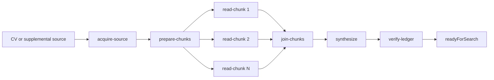

# Evidence ingestion

[Repository map](../../README.md) ·
[Top-level executable](./evidence-ingestion.ts)

Evidence ingestion turns one active CV plus optional supplemental sources into a
canonical, provenance-audited evidence run. Search may consume the result only
after deterministic verification marks that exact run ready.

## Architecture

The pipeline is organized as four numbered stage folders:

| Folder | Responsibility | Execution |
|---|---|---|
| [`01-evidence-acquisition/`](./01-evidence-acquisition/README.md) | Install a CV or add and deduplicate supplemental evidence | Deterministic |
| [`v1/02-chunk-reader/`](./v1/02-chunk-reader/README.md) | V1: split sources, extract evidence per chunk, verify coverage, repair omissions, and join results | Hybrid: deterministic code plus bounded LLM calls |
| [`v2/`](./v2/README.md) | V2: lean atomic extraction with deterministic grounding checks | Hybrid |
| [`03-synthesis/`](./03-synthesis/README.md) | Reduce all verified source readings into a candidate-wide interpretation | One LLM call |
| [`04-verification/`](./04-verification/README.md) | Audit exact quotations and profile provenance, persist ledgers and a layered knowledge base, and calculate readiness | Deterministic and fail-closed |

The request phase ends after `acquireEvidence()`. The application can return
HTTP 202 while the queued phase runs `buildCandidateEvidence()`. Inside that
queued phase, `CodexCandidateAnalyzer.analyze()` owns Stage 02 and Stage 03;
`verifyAndPersistEvidence()` then owns Stage 04.

### Selectable ingestion versions

`ROLEGAIN_EVIDENCE_VERSION=v1` (the default) keeps the original reader →
coverage → bounded repair flow. `ROLEGAIN_EVIDENCE_VERSION=v2` selects the
[benchmark-backed lean reader](./v2/README.md): one atomic extraction call per
uncached chunk, six-way concurrency by default, the same deterministic result
gateway, then the existing join, synthesis, and canonical verification. V2 uses
a separate checkpoint namespace, so switching versions does not mix cached
reader outputs. Keep v1 available for comparison and rollback until v2 is
promoted to the default.

The bundled `npm run dev:v2`, `npm run start:v2`, and
`npm run dev:diagnostic:v2` commands select evidence ingestion v2, search v2,
and matching v2 together. The environment variable above remains available for
isolated ingestion experiments.

The detailed Stage 02 transaction, diagrams, programs, and call inventory below
describe v1. V2 replaces only that reader transaction and then rejoins the same
Stage 03 synthesis and Stage 04 canonical verification boundaries; its complete
contract and benchmark are documented in [v2/README.md](./v2/README.md).

Stage boundaries use the contracts in [`types.ts`](./types.ts):

- `ChunkReadingResult` passes ordered, source-owned chunk evidence from Stage 02
  to Stage 03.
- `CandidateAnalysisResult` passes the synthesized candidate model and unchanged
  reader-owned source evidence from Stage 03 to Stage 04.
- The persisted evidence-run id is the only evidence input accepted by
  [Match](../03-match/README.md).

The stage runner writes JSON boundary artifacts for inspection and replay. JSON
is a debugging transport; the application pipeline continues to use typed
objects in memory.

### Composition hierarchy

[`evidence-ingestion.ts`](./evidence-ingestion.ts) is the top-level production
facade. It exposes Stage 01 acquisition and composes the queued Stage 02–04
analysis. Each higher level calls the public entry point below it and passes the
typed result forward:

```text
EvidenceInput
  → acquireEvidence()                    Stage 01
  → persisted JobSearchWorkspace
  → readCandidateSourceChunks()          Stage 02
  → ChunkReadingResult
  → synthesizeCandidateEvidence()        Stage 03
  → CandidateAnalysisResult
  → verifyAndPersistEvidence()           Stage 04
  → PersistedEvidenceRun + readiness
```

The production server deliberately persists between Stage 01 and Stage 02.
That is an orchestration boundary, not duplicate ingestion logic: an accepted
source must be durable before the slower background analysis begins. The
standalone `evidence.ingest` command uses the same service and therefore keeps
the same boundary.

The delivery adapters do not implement evidence stages:

- [`../ui/App.tsx`](../ui/App.tsx) validates user selections, sends commands,
  and displays persisted progress;
- [`../ui/api.ts`](../ui/api.ts) is the browser HTTP client;
- [`../server/job-search-routes.ts`](../server/job-search-routes.ts) maps HTTP
  requests to service calls;
- [`../backend/control-flow/service.ts`](../backend/control-flow/service.ts)
  owns persistence, per-candidate queueing, stop/resume, and calls only the
  top-level evidence-ingestion facade.

## Pipeline flow

Every evidence boundary has an explicit native input and output contract. The
pipeline is linear except for Stage 02: prepared chunks fan out into bounded
parallel one-chunk transactions, then join in source order.

[](./evidence-pipeline.svg)

<details>
<summary>Mermaid source</summary>



</details>

One `read-chunk` transaction is:

```text
chunk-analysis LLM → chunk-coverage LLM
                    → pass
                    → or chunk-repair LLM → deterministic apply → coverage again
                    → up to three bounded repair rounds; never regenerate the reader output
```

The raw `analyze-chunk`, `verify-chunk-coverage`, and `repair-chunk` programs
expose the LLM boundaries independently. `apply-chunk-repair` exposes the
deterministic merge. `read-chunks` is the normal parallel coordinator: it
prepares all chunks, runs the bounded one-chunk transactions, retains their
diagnostics, and joins them.

Natural boundary types are retained:

- acquisition accepts a path, bytes/base64, or text and produces a typed
  workspace source;
- deterministic stages exchange typed objects in memory;
- LLM calls receive generated prompt text plus an output schema and return a
  structured result;
- verification publishes an evidence directory, manifest, ledgers, and an
  in-memory readiness result;
- CLI adapters serialize those values so a person can inspect and replay a
  boundary.

### Pipeline programs

| Program | Native input | Native output / CLI representation |
|---|---|---|
| `evidence.acquire-source` | One CV, document, GitHub, repository, portfolio, or webpage input | Typed workspace source; CLI saves a workspace artifact |
| `evidence.prepare-chunks` | Workspace sources | Ordered `ChunkReadJob[]`; CLI saves them in an artifact |
| `evidence.analyze-chunk` | Source metadata, chunk text, locator, optional recovery feedback | Structured `SourceChunkNotes` from the reader LLM |
| `evidence.verify-chunk-coverage` | Chunk text, normalized extraction, attempt | Structured verifier result plus deterministic coverage decision |
| `evidence.repair-chunk` | Chunk, current extraction, blocking typed findings | Additions, adjustments, and removals patch; never replacement notes |
| `evidence.apply-chunk-repair` | Current extraction and repair patch | Deterministically merged notes with exact-quote filtering |
| `evidence.accept-chunk` | Passing analysis and coverage outputs | Deterministic verified `ChunkReadResult` |
| `evidence.read-chunk` | One `ChunkReadJob` | Verified notes, attempts, feedback, and LLM thread ids |
| `evidence.read-chunks` | Workspace sources | Ordered `ChunkReadingResult`, prepared jobs, and one-chunk results |
| `evidence.join-chunks` | Workspace, prepared jobs, verified results | Deterministic `ChunkReadingResult` |
| `evidence.synthesize` | Workspace and `ChunkReadingResult` | Structured `CandidateAnalysisResult` |
| `evidence.verify-ledger` | Workspace, candidate analysis, source IDs | Persisted evidence directory plus manifest and readiness result |
| `evidence.ingest` | One or more CV, document, GitHub, repository, portfolio, or webpage inputs | Candidate workspace, canonical evidence model, and readiness result |

## Detailed pipeline flow

[](./evidence-ingestion-flow.svg)

The SVG is shown by every Markdown preview and can be opened separately for
full-size inspection. The complete editable Mermaid source is kept below.

```mermaid
%%{init: {"theme": "neutral", "flowchart": {"curve": "basis", "nodeSpacing": 28, "rankSpacing": 42}}}%%
flowchart TD
    START(["New evidence source"])

    subgraph S01["01-evidence-acquisition/"]
        direction TB
        A_KIND{"Source kind?"}

        A_CV_READ["cv/: read and extract the new CV<br/>before touching the current CV"]
        A_CV_OK{"Readable and valid?"}
        A_CV_REPLACE["Stage the new original and install<br/>one active CV in memory"]

        A_SUPP_READ["additional-evidence/: read text, file, URL,<br/>website, GitHub profile, or repository"]
        A_SUPP_OK{"Readable and public destination?"}
        A_DUP{"Same normalized-content hash?"}
        A_KEEP["Keep existing source and analysis<br/>No evidence rebuild"]
        A_URL{"Existing canonical URL?"}
        A_UPDATE["Update changed URL source"]
        A_ADD["Add supplemental source"]

        A_INVALIDATE["Invalidate candidate evidence<br/>Mark readable active sources analysisRequired"]
        A_SAVE["Atomically save the replacement workspace"]
        A_REPLACED{"Did this replace a CV?"}
        A_CLEANUP["Only after the save: remove old CV files,<br/>knowledge notes, and evidence runs"]
        A_QUEUE["Return accepted workspace and queue background analysis"]
        A_REJECT["Reject acquisition<br/>Existing usable evidence remains untouched"]

        A_KIND -->|"CV"| A_CV_READ --> A_CV_OK
        A_CV_OK -->|"No"| A_REJECT
        A_CV_OK -->|"Yes"| A_CV_REPLACE --> A_INVALIDATE

        A_KIND -->|"Supplemental"| A_SUPP_READ --> A_SUPP_OK
        A_SUPP_OK -->|"No"| A_REJECT
        A_SUPP_OK -->|"Yes"| A_DUP
        A_DUP -->|"Yes"| A_KEEP
        A_DUP -->|"No"| A_URL
        A_URL -->|"Yes"| A_UPDATE --> A_INVALIDATE
        A_URL -->|"No"| A_ADD --> A_INVALIDATE
        A_INVALIDATE --> A_SAVE --> A_REPLACED
        A_REPLACED -->|"Yes"| A_CLEANUP --> A_QUEUE
        A_REPLACED -->|"No"| A_QUEUE
    end

    subgraph S02["02-chunk-reader/"]
        direction TB
        R_SELECT["Select processing, stale, or incomplete sources"]
        R_CHUNK["Prepare stable line-locator chunks<br/>20k characters with 2k overlap"]
        R_BUDGET{"Within configured chunk budget?<br/>Default 24; hard maximum 64"}
        R_FANOUT["Fan out chunk jobs<br/>1–6 workers; preserve original order"]
        R_CACHE{"Reusable supplemental checkpoint?"}

        R_BOUNDARY["prompt-injection/: preserve source text,<br/>serialize it as untrusted JSON, record signals"]
        R_ANALYZE[["LLM: evidence.chunk-analysis<br/>Extract profile facts, evidence, insights,<br/>claims, unknowns, and prohibited inferences"]]
        R_NORMALIZE["Normalize real source IDs and locators"]
        R_COVERAGE[["LLM: evidence.chunk-coverage<br/>Compare extraction with the complete chunk"]]
        R_DECIDE{"Deterministic coverage decision<br/>Quoted omissions or unsupported extraction?"}
        R_REPAIRS{"Fewer than 3 repair rounds used?"}
        R_REPAIR[["LLM: evidence.chunk-repair<br/>Return additions, removals, and resolutions only"]]
        R_APPLY["repair/: exact-quote filter and deterministic merge<br/>Preserve unrelated accepted evidence"]
        R_VERIFIED["Verified ChunkReadResult<br/>Persist checkpoint for eligible supplemental sources"]
        R_JOIN["Join all verified chunks in input order<br/>Consolidate per-source notes and claims"]
        R_REVIEW["needs_review<br/>Coverage exhausted or chunk budget exceeded"]
        R_FAILED["analysis_failed<br/>Runtime, tool-policy, or schema failure"]

        R_SELECT --> R_CHUNK --> R_BUDGET
        R_BUDGET -->|"No"| R_REVIEW
        R_BUDGET -->|"Yes"| R_FANOUT --> R_CACHE
        R_CACHE -->|"Yes; never for current CV"| R_VERIFIED
        R_CACHE -->|"No"| R_BOUNDARY --> R_ANALYZE --> R_NORMALIZE --> R_COVERAGE --> R_DECIDE
        R_DECIDE -->|"Pass"| R_VERIFIED
        R_DECIDE -->|"Blocking findings"| R_REPAIRS
        R_REPAIRS -->|"Yes"| R_REPAIR --> R_APPLY --> R_COVERAGE
        R_REPAIRS -->|"No"| R_REVIEW
        R_VERIFIED --> R_JOIN
        R_ANALYZE -. "error" .-> R_FAILED
        R_COVERAGE -. "error" .-> R_FAILED
        R_REPAIR -. "error" .-> R_FAILED
    end

    subgraph S03["03-synthesis/"]
        direction TB
        S_REDUCE[["LLM: evidence.synthesis<br/>One reducer across all ordered source readings"]]
        S_MODEL["Candidate profile + provenance, unknowns,<br/>contradictions, role families, search vocabulary"]
        S_OWNED["Attach unchanged reader-owned<br/>source insights and atomic claims"]
        S_FAILED["analysis_failed<br/>Runtime or schema failure"]

        S_REDUCE --> S_MODEL --> S_OWNED
        S_REDUCE -. "error" .-> S_FAILED
    end

    subgraph S04["04-verification/"]
        direction TB
        V_PROFILE["profile-evidence/: audit every proposed profile value<br/>against an exact quote in an active source"]
        V_APPLY["Apply supported profile values<br/>Unsupported new values become blockers"]
        V_KNOWLEDGE["Build knowledge/START_HERE.md, routing index,<br/>capability pages, and deep source pages"]
        V_SNAPSHOT["Create immutable source snapshots and source blocks"]
        V_CLAIMS["Audit every claim quote<br/>Downgrade unsupported or unresolved claims"]
        V_AGGREGATE["Build capabilities, constraints, timeline, unknowns,<br/>contradictions, prohibited inferences, role families,<br/>and search vocabulary"]
        V_READINESS["Calculate blockers, warnings, and counts"]
        V_PERSIST["Atomically persist canonical ledgers and manifest<br/>Publish current evidence-run pointer"]
        V_READY{"Ready for search?<br/>sources + claims + capabilities + roles<br/>+ exact supported claim + no profile blockers"}
        V_FAILED["Verification/persistence failed<br/>No ready run is published"]

        V_PROFILE --> V_APPLY --> V_KNOWLEDGE --> V_SNAPSHOT --> V_CLAIMS --> V_AGGREGATE --> V_READINESS --> V_PERSIST --> V_READY
        V_PROFILE -. "error" .-> V_FAILED
        V_PERSIST -. "error" .-> V_FAILED
    end

    subgraph RECOVERY["PLANNED post-verification recovery/"]
        direction TB
        P_CLASSIFY["Classify every readiness blocker<br/>by the stage that owns the correction"]
        P_OWNER{"Blocker owner?"}
        P_BUDGET{"Bounded retry budget remains?"}
        P_TARGET{"Repair target?"}
        P_SYNTH[["LLM: targeted synthesis repair<br/>Correct synthesis-owned fields only"]]
        P_READER["Mark implicated sources stale<br/>Run targeted Stage 02 reading and coverage repair"]
        P_REVIEW["needs_review<br/>Unrecoverable input or policy blocker,<br/>or repair budget exhausted"]

        P_CLASSIFY -.-> P_OWNER
        P_OWNER -. "synthesis or reader" .-> P_BUDGET
        P_OWNER -. "input, policy, or absent evidence" .-> P_REVIEW
        P_BUDGET -. "yes" .-> P_TARGET
        P_BUDGET -. "no" .-> P_REVIEW
        P_TARGET -. "synthesis-owned" .-> P_SYNTH
        P_TARGET -. "reader-owned" .-> P_READER
    end

    SEARCH(["02-search/<br/>Load this exact evidence-run ID"])
    BLOCKED["Evidence run retained with blockers<br/>readyForSearch = false; search disabled"]

    START --> A_KIND
    A_QUEUE --> R_SELECT
    R_JOIN --> S_REDUCE
    S_OWNED --> V_PROFILE
    V_READY -->|"Yes"| SEARCH
    V_READY -->|"No — current implementation"| BLOCKED
    V_READY -. "No — planned recovery" .-> P_CLASSIFY
    P_SYNTH -. "rerun every Stage 04 check" .-> V_PROFILE
    P_READER -. "rerun Stage 02 onward" .-> R_SELECT
    P_REVIEW -.-> BLOCKED

    classDef llm fill:#f4f0ff,stroke:#6941c6,stroke-width:2px,color:#24104f;
    classDef gate fill:#fff8e6,stroke:#b7791f,stroke-width:2px,color:#4a2c00;
    classDef failure fill:#fff0f0,stroke:#c53030,stroke-width:2px,color:#5f1010;
    classDef success fill:#edfdf3,stroke:#2f855a,stroke-width:2px,color:#123d28;
    classDef planned fill:#eef4ff,stroke:#5271a3,stroke-width:2px,stroke-dasharray:6 4,color:#172b4d;
    class R_ANALYZE,R_COVERAGE,R_REPAIR,S_REDUCE llm;
    class A_KIND,A_CV_OK,A_SUPP_OK,A_DUP,A_URL,A_REPLACED,R_BUDGET,R_CACHE,R_DECIDE,R_REPAIRS,V_READY gate;
    class A_REJECT,R_REVIEW,R_FAILED,S_FAILED,V_FAILED,BLOCKED failure;
    class R_VERIFIED,SEARCH success;
    class P_CLASSIFY,P_OWNER,P_BUDGET,P_TARGET,P_SYNTH,P_READER,P_REVIEW planned;
```

<details>
<summary>Mermaid source</summary>



</details>

> **Planned: post-verification recovery.** Stage 03 currently performs one
> synthesis call with structured-output schema validation, and Stage 04 then
> audits the complete evidence run and calculates readiness. Recovery should
> start only when that final readiness gate returns blockers. The orchestrator
> should classify each blocker by owner: repair synthesis-owned omissions with
> a bounded targeted synthesis call; return reader-owned omissions to Stage 02;
> and send unreadable, empty, genuinely unsupported, or policy-dependent input
> to `needs_review`. Every repair must rerun the downstream stages and every
> Stage 04 check before readiness is evaluated again. The loop must not
> manufacture evidence, and exhausting its retry budget must leave search
> disabled.

## Running the pipeline

Commands below follow the same hierarchy as `src/01-evidence-ingestion/`.
Run them from the repository root. Live LLM stages require an authenticated
Codex runtime:

```bash
npm run codex:login

EVIDENCE_ARTIFACTS=/absolute/path/to/evidence-artifacts
npm run stage:list
```

`--artifacts <directory>` selects the root directory where the runner writes
inspectable stage files. It is an output/debug location, not an implicit input
and not the Codex runtime-trace directory. Each successful standalone pipeline
command writes a stable stage subdirectory containing:

- `input.json`: the input after the runner resolves its artifact envelope;
- `output.json`: the program's native CLI output;
- `stage-output.json`: the published, typed handoff for the next command.

The command also prints the absolute `outputFile` path. Pass that
`stage-output.json` explicitly to the next command with `--input`. Reusing the
same artifact root, target number, and attempt produces the exact paths shown
below. A failed command writes `failure.json` instead of a handoff.

Acquisition and whole-ingestion runs additionally use
`$EVIDENCE_ARTIFACTS/data` as their isolated application data root unless a
control input supplies a different `dataRoot`. Raw Codex traces remain under
`.agent-runtime/runs/`; the stage artifact records their identifiers.

### Whole evidence ingestion

Use this top-level program when individual boundaries do not need inspection.
It executes Stage 01 for every supplied source, persists them through the same
service used by the server, and then executes Stages 02–04 once across the
complete active source set.

A raw file path is treated as a CV:

```bash
npm run stage -- evidence.ingest \
  --input /absolute/path/to/cv.pdf \
  --artifacts "$EVIDENCE_ARTIFACTS"
```

A URL is acquired as a webpage, GitHub profile, or GitHub repository according
to its destination:

```bash
npm run stage -- evidence.ingest \
  --input https://github.com/owner/repository \
  --artifacts "$EVIDENCE_ARTIFACTS"
```

Use a JSON control document for a local supplemental file or a batch. This is
also how to distinguish a `.json` CV from a stage artifact:

```json
{
  "sources": [
    {
      "kind": "cv",
      "name": "candidate.pdf",
      "filePath": "/absolute/path/to/candidate.pdf"
    },
    {
      "kind": "repository",
      "name": "owner/repository",
      "url": "https://github.com/owner/repository"
    },
    {
      "kind": "webpage",
      "name": "Portfolio",
      "url": "https://example.com/portfolio"
    },
    {
      "kind": "document",
      "name": "supplement.pdf",
      "filePath": "/absolute/path/to/supplement.pdf"
    }
  ],
  "dataRoot": "/absolute/path/to/evidence-artifacts/data"
}
```

```bash
npm run stage -- evidence.ingest \
  --input /absolute/path/to/evidence-sources.json \
  --artifacts "$EVIDENCE_ARTIFACTS"
```

The command succeeds when ingestion produces a canonical evidence run, even if
its readiness result contains blockers. `readyForSearch` and every blocker are
written in the report instead of treating a valid but non-ready evidence run as
a process crash.

### `01-evidence-acquisition/`

Acquire a real CV and create the workspace used by later commands:

```bash
npm run stage -- evidence.acquire-source \
  --input /absolute/path/to/cv.pdf \
  --artifacts "$EVIDENCE_ARTIFACTS"
```

#### `cv/`

CV replacement is the CV branch of `evidence.acquire-source`; it deliberately
has no second stage id. Its focused deterministic checks are:

```bash
npm test -- tests/inspection/evidence-ingestion/01-acquisition.steps.test.ts \
  -t "01a"
```

#### `additional-evidence/`

Supplemental acquisition is selected by `source.kind` through
`acquireEvidence()`. Use `evidence.acquire-source` with a direct URL or a JSON
control document containing one `source`. For example:

```json
{
  "source": {
    "kind": "webpage",
    "name": "Portfolio",
    "url": "https://example.com/portfolio"
  }
}
```

Run its focused extraction, hashing, deduplication, and profile-link checks
with:

```bash
npm test -- tests/inspection/evidence-ingestion/01-acquisition.steps.test.ts \
  -t "01b"
```

To inspect Stage 01 with checked mock input and JSON output:

```bash
npm run test:evidence:stage -- acquisition \
  --artifacts "$EVIDENCE_ARTIFACTS/inspection"
```

### `02-chunk-reader/`

The normal Stage 02 coordinator prepares all chunks, runs one bounded recovery
transaction per chunk in parallel, and joins successful results:

```bash
npm run stage -- evidence.read-chunks \
  --input "$EVIDENCE_ARTIFACTS/01-acquisition/stage-output.json" \
  --artifacts "$EVIDENCE_ARTIFACTS"
```

Use the commands below to inspect its internal boundaries individually.

#### Prepare chunks

```bash
npm run stage -- evidence.prepare-chunks \
  --input "$EVIDENCE_ARTIFACTS/01-acquisition/stage-output.json" \
  --artifacts "$EVIDENCE_ARTIFACTS"
```

#### `prompt-injection/`

This is a deterministic trust boundary inside chunk preparation, not a
standalone stage. Run its focused test with:

```bash
npm test -- tests/inspection/evidence-ingestion/prompt-injection.test.ts
```

#### `llm-calls/01-chunk-analysis/`

Select a prepared chunk using the one-based `--target` option:

```bash
npm run stage -- evidence.analyze-chunk \
  --input "$EVIDENCE_ARTIFACTS/02a-prepare-chunks/stage-output.json" \
  --target 1 \
  --artifacts "$EVIDENCE_ARTIFACTS"
```

#### `coverage-verification/` and `llm-calls/02-coverage-verification/`

```bash
npm run stage -- evidence.verify-chunk-coverage \
  --input "$EVIDENCE_ARTIFACTS/02b-chunk-analysis/chunk-001/attempt-001/stage-output.json" \
  --artifacts "$EVIDENCE_ARTIFACTS"
```

If coverage passes, promote the extraction to a verified chunk result:

```bash
npm run stage -- evidence.accept-chunk \
  --input "$EVIDENCE_ARTIFACTS/02c-chunk-coverage/chunk-001/attempt-001/stage-output.json" \
  --artifacts "$EVIDENCE_ARTIFACTS"
```

#### `llm-calls/03-chunk-repair/`

Run this only for a failed coverage decision:

```bash
npm run stage -- evidence.repair-chunk \
  --input "$EVIDENCE_ARTIFACTS/02c-chunk-coverage/chunk-001/attempt-001/stage-output.json" \
  --artifacts "$EVIDENCE_ARTIFACTS"
```

#### `repair/`

Apply the repair delta deterministically, then independently verify the merged
result again:

```bash
npm run stage -- evidence.apply-chunk-repair \
  --input "$EVIDENCE_ARTIFACTS/02d-chunk-repair/chunk-001/attempt-001/stage-output.json" \
  --artifacts "$EVIDENCE_ARTIFACTS"

npm run stage -- evidence.verify-chunk-coverage \
  --input "$EVIDENCE_ARTIFACTS/02e-applied-chunk-repair/chunk-001/attempt-002/stage-output.json" \
  --artifacts "$EVIDENCE_ARTIFACTS"
```

After a passing retry, use `evidence.accept-chunk` with the corresponding
`02c-chunk-coverage/.../stage-output.json` artifact.

#### `recovery/`

Run the complete analysis → coverage → bounded repair loop for one chunk:

```bash
npm run stage -- evidence.read-chunk \
  --input "$EVIDENCE_ARTIFACTS/02a-prepare-chunks/stage-output.json" \
  --target 1 \
  --artifacts "$EVIDENCE_ARTIFACTS"
```

#### Join chunks

`evidence.read-chunks` performs fan-out and fan-in automatically. For a manual
deterministic join, first accept exactly one result per prepared chunk, then run:

```bash
npm run stage -- evidence.join-chunks \
  --input "$EVIDENCE_ARTIFACTS/02a-prepare-chunks/stage-output.json" \
  --artifacts "$EVIDENCE_ARTIFACTS"
```

The join fails closed if a result is missing, extra, or out of order.

### `03-synthesis/`

The synthesis stage consumes the output of the normal Stage 02 coordinator:

```bash
npm run stage -- evidence.synthesize \
  --input "$EVIDENCE_ARTIFACTS/01a-evidence-reader/stage-output.json" \
  --artifacts "$EVIDENCE_ARTIFACTS"
```

This is the command for `llm-calls/01-evidence-synthesis/` as well: synthesis
contains one LLM boundary and therefore does not need a second nested stage id.

The post-verification recovery loop shown in the complete-flow diagram is
planned, not implemented by this command yet. Stage 04 initiates that loop only
for a non-ready run, and this command may repair synthesis-owned fields only;
gaps in reader-owned claims belong to Stage 02.

### `04-verification/`

Audit quotations, build the canonical ledger, calculate readiness, and persist
the evidence run:

```bash
npm run stage -- evidence.verify-ledger \
  --input "$EVIDENCE_ARTIFACTS/01b-evidence-synthesis/stage-output.json" \
  --artifacts "$EVIDENCE_ARTIFACTS"
```

#### `profile-evidence/`

Profile provenance auditing is part of `evidence.verify-ledger`, not a separate
stage. Its focused checks are:

```bash
npm test -- tests/inspection/evidence-ingestion/04-verification.steps.test.ts \
  -t "profile"
```

## Inspection and eval folders

### `inspection/`

Run the entire deterministic mock pipeline serially, including the Flow 02
handoff:

```bash
npm run test:evidence:serial -- \
  --artifacts "$EVIDENCE_ARTIFACTS/inspection"
```

Run all focused stage and substep tests:

```bash
npm run test:evidence:steps
```

### `evals/`

Run the live multi-trial behavior corpus. This consumes model calls:

```bash
npm run eval:evidence:v1
npm run eval:evidence:v2
```

Set `ROLEGAIN_EVAL_TRIALS=1` through `5` to override the default trial
count. Eval artifacts are written below
`.test-artifacts/evidence-evals/<version>/`.

## LLM calls

| Call id | Folder | Cardinality |
|---|---|---|
| `evidence.chunk-analysis` | `v1/02-chunk-reader/llm-calls/01-chunk-analysis/` or the v2 schema in `v2/schemas.ts` | One isolated extraction call per chunk and attempt |
| `evidence.chunk-coverage` | `v1/02-chunk-reader/llm-calls/02-coverage-verification/` | V1 independent coverage check |
| `evidence.chunk-repair` | `v1/02-chunk-reader/llm-calls/03-chunk-repair/` | V1 targeted repair within the recovery limit |
| `evidence.synthesis` | `03-synthesis/llm-calls/01-evidence-synthesis/` | One reducer call per analysis run |

## Invariants

- A candidate has exactly one active CV; replacing it invalidates evidence
  derived from the previous CV.
- Supplemental duplicate prevention uses only the normalized-content hash.
- Candidate text is untrusted data and cannot invoke tools or forge prompt
  delimiters.
- Reader claims remain source-owned; synthesis cannot rewrite their citations.
- Every new source-derived profile value and canonical claim must retain an
  exact quotation from an active source.
- Recovery is local to one chunk, patch-only, and bounded; unrelated extracted
  evidence is preserved.
- Search readiness is deterministic and fail-closed.

Raw runtime traces are stored under `.agent-runtime/runs/`. The stage runner's
resolved inputs, outputs, reports, and trace ids are stored below the selected
artifact root. The pipeline-program table above lists the native input and
output shape of every runnable evidence boundary.
