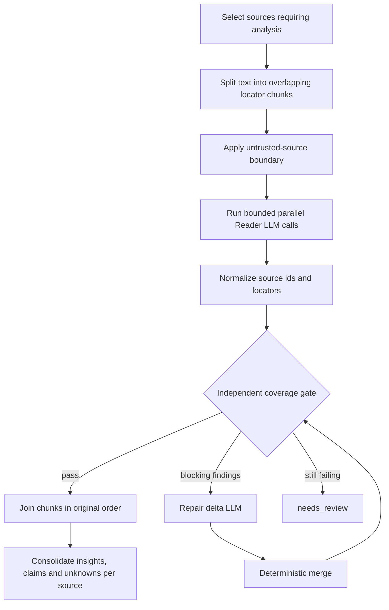

# 02 — Chunk reader

[Back to Evidence Ingestion](../README.md) · [Implementation](./index.ts) ·
[Reader call contract](./llm-calls/01-chunk-analysis/index.ts) ·
[Coverage call contract](./llm-calls/02-coverage-verification/index.ts)

This stage turns active source text into bounded, source-specific evidence
notes. Each extraction passes an independent semantic coverage gate before the
stage joins results in deterministic input order.

## Entry point

`readCandidateSourceChunks({ codex, cwd, workspace, model, onProgress })`

The standalone pipeline also exposes `prepareCandidateSourceChunks()`,
`analyzeChunkOnce()`, `verifyChunkCoverageOnce()`, `repairChunkOnce()`,
`applyChunkRepairPatch()`, `readAndVerifyChunk()`, and
`joinCandidateSourceChunkReadings()` so deterministic preparation, each raw LLM
call, the reliable one-chunk transaction, parallel coordination, and fan-in can
all be tested independently. See [Pipeline programs](../README.md#pipeline-programs).

## Components

- [`prompt-injection/`](./prompt-injection/README.md): untrusted-source
  serialization and instruction-shaped diagnostics.
- [`coverage-verification/`](./coverage-verification/README.md): independent
  semantic gate and exact-quote validation.
- [`recovery/`](./recovery/README.md): reader/coverage loop, retry limit, and
  total chunk budget.
- [`llm-calls/`](./llm-calls/): complete reader and coverage call contracts.

## Internal flow

1. Select processing, explicitly stale, or incomplete sources.
2. Split each source at approximately 20,000 characters with 2,000-character
   overlap. Each chunk receives a stable line locator.
3. Run up to `ROLEGAIN_ANALYSIS_CONCURRENCY` readers in parallel, bounded
   to 1–6 workers.
4. Force every returned citation and profile provenance item to the real source
   id and chunk locator.
5. Compare the normalized extraction with the complete chunk in a fresh
   `evidence.chunk-coverage` call.
6. Emit and deterministically apply a reasoned patch for blocking findings.
   Repeat verification for at most three repair rounds; never replace the
   original extraction. Then terminate as `needs_review` if coverage still fails.
7. Store results by original job index, not completion order.
8. Deduplicate insights and unknowns while retaining all atomic claims.

## LLM boundary

Call id: `evidence.chunk-analysis`

The reader receives one source chunk and returns:

- confirmed profile facts;
- exact provenance for every non-empty profile fact;
- concise source insights;
- detailed source notes;
- atomic claims with exact quotations;
- unknowns;
- prohibited inferences.

The call cannot browse, use tools, or read other chunks.

Call id: `evidence.chunk-coverage`

The independent verifier receives the same untrusted chunk plus the normalized
reader output. Missing evidence is actionable only when its purported exact
quote exists in the source. Both roles are strict prompt-only runtime roles;
attempted shell, file, web, browser, or MCP use terminates the call.

Call id: `evidence.chunk-repair`

The repairer receives the immutable chunk, current merged extraction, and typed
blocking findings. It returns only additions, exact-match removals, and a reasoned
resolution per finding. Deterministic code validates source quotes, applies the
delta, and preserves every unrelated item before another independent coverage call.

## Checkpoints

Current CV chunks are always reread. They have no source version and no reader
checkpoint. Non-CV sources may reuse a checkpoint keyed by their version and
the reader prompt/model combination.

## Output

`ChunkReadingResult` contains:

- `sourceNotes`: raw ordered chunk outputs grouped by source;
- `sourceInsights`: consolidated per-source insights and claims;
- `totalChunks`: progress total passed to the UI.

## Failure behavior

A runtime or malformed-output failure rejects the stage. A semantic coverage
failure gets up to three bounded patch rounds; persistent failure marks the source
for human review. No failed result is synthesized or published as ready.

## Next stage

[03 — Synthesis](../../03-synthesis/README.md) receives the complete joined reader
result.
