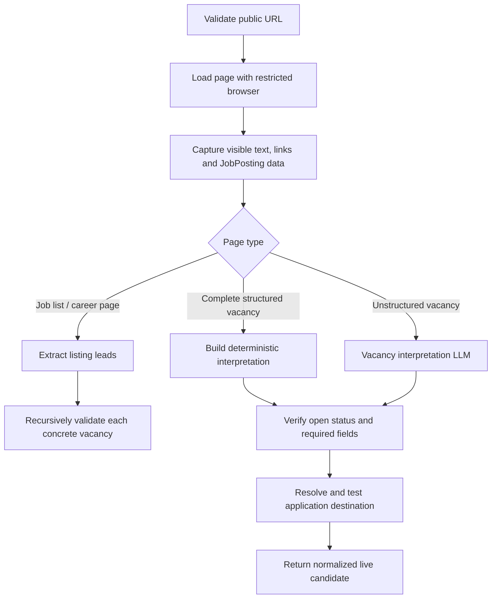

# 02 — Vacancy validation

[Back to Search](../README.md) · [Orchestration](./index.ts) ·
[Page interpreter](./interpreter.ts) ·
[Failure classification](./failure-classification.ts)

Direct per-lead entry point: [`validateOneVacancy()`](./validate-one/index.ts)

This stage converts an untrusted search lead into a verified, current vacancy.
It owns browser acquisition, listing expansion, semantic interpretation, apply
URL resolution, and revalidation.

## Entry points

- `resolveDiscoveredJobs(...)` validates one search lead and may return several
  vacancies when the lead is a job list.
- `revalidateOpportunities(...)` reloads already known opportunities before
  they are reused from the bench.

## Internal flow

## Security boundary

Every requested URL passes `infrastructure/public-http.ts`. Localhost, private
network addresses, unsupported protocols, unsafe redirects, and non-public
subresources are blocked. Images, media, and fonts are not loaded.

## LLM boundaries

### `search.listing-extraction`

Used only for a captured job list or recruitment page. It returns concrete
vacancy leads supported by visible page text and links. Deterministic link
extraction is merged with the model output.

### `search.vacancy-verification`

Used when structured `JobPosting` data is insufficient. It classifies page
type/open status and extracts vacancy fields from one frozen page snapshot. It
cannot browse or fetch another page.

## Deterministic verification

- Structured `JobPosting` data is preferred when complete.
- Extracted evidence must appear in the captured page corpus.
- Closed, expired, blocked, ambiguous, and non-vacancy pages fail closed.
- The apply destination is loaded and checked before acceptance.
- Greenhouse job-board URLs may be resolved through the public Greenhouse API
  when the visible board endpoint is blocked.
- Failures receive a stable reason code and disposition: rejected, manual
  review, unresolved, or source page.

## Output

One input lead can produce zero, one, or several normalized `LiveCandidate`
records. Each contains the actual vacancy URL, tested application URL, complete
description, location/workplace facts, compensation text, and discovery
provenance.

Each passing concrete vacancy is emitted immediately. The validation stage does
not wait for its sibling workers before that vacancy may enter matching.

## Consumers

- [01 — Discovery](../01-discovery/README.md) calls this for new leads.
- `LiveOpportunityResearcher.revalidate()` calls it before a previously scored
  opportunity is reused.
