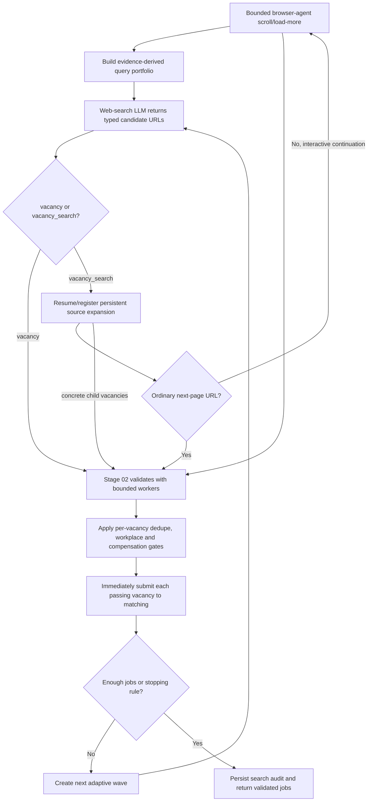

# 01 — Discovery

[Back to Search](../README.md) · [Implementation](./index.ts) ·
[Web-search call contract](./llm-calls/01-web-search/index.ts) ·
[Run one search](./run-one-search.ts)

This stage owns adaptive public-web discovery and the outer vacancy-validation
loop. Search leads are hints only; none becomes a `JobOpportunity` until Stage
02 has loaded and validated the actual page.

## Entry point

`searchAndValidateOpportunities({ codex, cwd, dataRoot, browsers, workspace, options })`

`LiveOpportunityResearcher.research()` is the public adapter that calls it.

## Internal flow

## Search planning

The stage loads `shared/evidence-context.ts`, requiring the same ready evidence
run referenced by the workspace. It derives direct, adjacent, and stretch role
lanes, query families, negative terms, constraints, and source coverage cells.
Profile summaries do not replace canonical claims.

## LLM boundary

Call id: `search.web-discovery`

This is the only model call allowed live web search. It returns concrete,
individually named vacancy URLs and relevant vacancy-search sources with the
query and source class that produced each lead. A source is persisted and
expanded; it is never presented as a vacancy. Every concrete child remains
untrusted until page, status, location, and application validation pass.
`runOneSearch(input)` exposes exactly one such call for inspection or targeted
execution with a prepared canonical evidence context.

## Adaptive waves

- Maximum: six waves, configurable downward with
  `ROLEGAIN_MAX_SEARCH_WAVES`.
- Stops when the target is reached, the wave budget is exhausted, or two
  consecutive waves produce no newly validated jobs.
- Already seen source and application URLs are excluded from later waves.
- Validation errors feed the next wave so it can try different sources.

## Deterministic gates

After Stage 02 validation, this stage:

- removes duplicate canonical vacancies;
- enforces confirmed workplace/location preferences;
- rejects published compensation ranges below a confirmed floor;
- computes opportunity confidence from source authority and page completeness;
- creates the final `JobOpportunity` record with validation provenance.

Undisclosed compensation remains unresolved rather than being treated as a
proven violation.

## Output and persistence

Returns validated opportunities, failures, and every seen URL. It also writes a
search-run manifest, plan, wave ledger, coverage ledger, validated jobs, and
rejected leads under the candidate run directory.

## Next stage

In the live opportunity-research path, each validated opportunity is submitted immediately
to [03-match/shared/01-requirement-matching](../../../03-match/shared/01-requirement-matching/README.md). The
standalone `research()` adapter still returns a complete validated collection
for stage inspection and compatibility. Stage 02 is called inside discovery for
every candidate URL.

## Later next-five runs

Every run loads saved vacancy sources in addition to fresh web results. Pending
children are consumed first while the source is fresh. Once its freshness TTL
expires, the source head is refreshed before that backlog so recent vacancies
cannot be starved. A source with more pages then resumes its saved cursor.
Child URLs are deduplicated by the source checkpoint; jobs already represented
by applications remain excluded by the workspace.

Interactive sources persist semantic replay actions such as `scroll × 4` or
`load more × 3`. On a later run the backend replays them before asking the
source-navigation model for another bounded action. Pixel positions and live
browser tabs are deliberately not treated as durable cursors.
