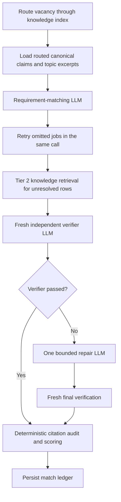

# 03 — Requirement matching

[Back to Match](../README.md) · [Implementation](./index.ts)

[Match one vacancy](./match-one/index.ts) ·
[Reverse-verify one match](./reverse-verification/index.ts) ·
[Verifier LLM execution](./run-match-verification.ts)

This stage builds an exhaustive vacancy-requirement matrix against the
canonical claim ledger. The evidence knowledge base routes broad vacancy
language to a bounded set of topic pages and their claim ids. Unresolved rows
can inspect bounded topic and source-page excerpts in Tier 2. Knowledge prose
provides retrieval context only; independently verified canonical citations
remain the scoring authority.

## Entry point

`matchOpportunities({ codex, cwd, dataRoot, workspace, opportunities, onProgress })`

The streaming orchestrator submits `matchOneOpportunity()` as soon as one
vacancy passes validation. `LiveOpportunityResearcher.assess()` remains the
batch-compatible public adapter.

## Internal flow

## LLM boundaries

### `match.requirements`

Extracts every core responsibility, mandatory qualification, preferred
qualification, and constraint. Every matched or partial row must cite a
supplied canonical claim. Routed topic excerpts help interpret ambiguous
requirements but cannot be cited independently. A same-thread retry is allowed
only when a job was omitted.

### `match.tier2-evidence`

Runs only for unresolved rows and reads bounded topic excerpts plus relevant
sections from linked source pages. It cannot browse. Its citations must map
back to the canonical ledger.

### `match.verification`

Runs in a fresh context and checks vacancy-section extraction, citation
validity, match-class inflation, scope/ownership claims, and feasibility.

### `match.repair`

Receives only failed jobs and verifier findings. It can run once. Repaired jobs
must pass another fresh verification or are rejected.

## Deterministic checks

- Exact claim id, source id, source version, locator, and excerpt validation.
- Weakly supported claims can justify only partial matches.
- Responsibility, mandatory, preferred, and constraint rows remain separate.
- Ownership, maturity, scope, work context, tools, credentials, and duration
  are not inferred from each other.
- Rows outside the employer-authored responsibility or qualification sections
  are rejected.
- Feasibility and opportunity confidence remain separate from evidence fit.

## Scoring

`calculateRequirementScore()` applies deterministic category weights, match
credit, confidence, evidence quality, and feasibility rules. The model never
returns the final percentage.

## Output and persistence

Returns assessed opportunities and rejected failures. Each accepted opportunity
contains the requirement matrix, score breakdown, strengths, gaps, feasibility
gate, portfolio category, and skeptical-review record. A match audit is written
under its search run.

## Next stage

Selected opportunities continue to
[05 — Application Inspection](../02-application-inspection/README.md).
