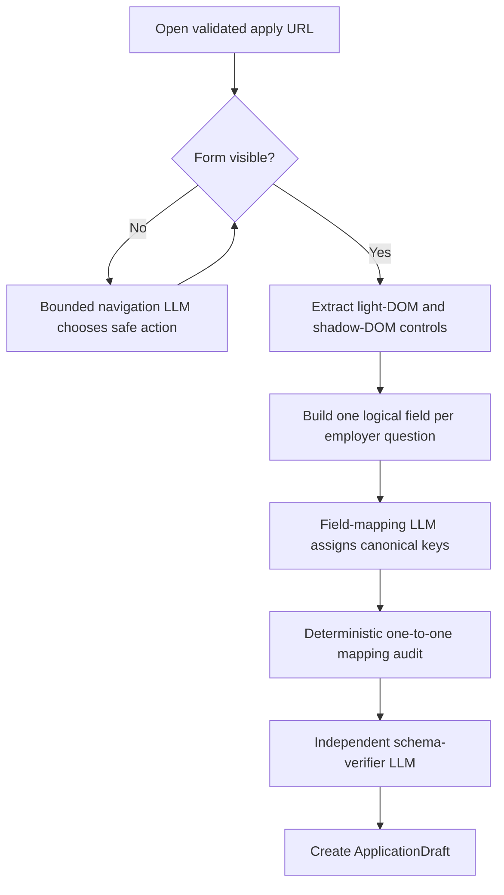

# 04 — Application inspection

[Back to Match](../README.md) · [Implementation](./index.ts)

This stage opens the employer application destination, reveals the real form,
extracts every logical question, maps it to candidate facts, and independently
audits that mapping. It never submits the form.

## Entry point

`inspectOpportunityApplications({ codex, cwd, browsers, workspace, opportunities, onProgress })`

`LiveOpportunityResearcher.inspectApplications()` calls it after requirement
matching and portfolio selection.

## Internal flow

## LLM boundaries

### `application.navigate`

Chooses one click, scroll, wait, or stop action from a frozen page observation.
The backend rejects unsafe controls and executes the action. Maximum six steps.
Submit, authentication, consent, demographic, and legal-term controls are
forbidden.

### `application.field-map`

Maps multilingual labels and employer control names to canonical candidate
facts. Structural keys such as cover letter and CV upload are preserved
deterministically.

### `application.schema-verify`

Freshly compares the complete observed schema with mapped fields. It reports
omissions, duplicates, lost choices/required flags, incompatible controls, and
obviously incorrect semantic mappings.

## Form extraction

The stage reads visible native controls, radio/checkbox groups, contenteditable
fields, accessible comboboxes, and open shadow roots. Related controls are
grouped into one logical question while stable employer identifiers preserve
one-to-one mapping.

## Validation and output

An application is form-validated only when:

- at least one logical question was observed;
- observed and mapped counts are equal;
- field ids and employer ids are unique;
- the deterministic audit has no findings;
- the independent schema audit has no findings.

The output contains `ApplicationDraft` records plus failures for protected,
blocked, inaccessible, or ambiguously mapped forms.

## Next flow

Validated application drafts continue to
[Flow 03 — Application Preparation](../../04-application-preparation/README.md).
The later deterministic browser actuator fills saved values but leaves final
review and submission to the user.
