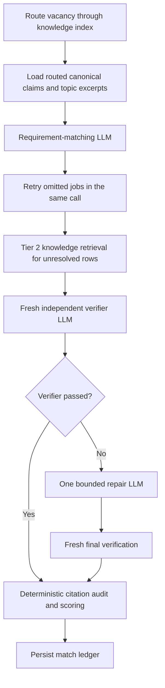

# 03 — Requirement matching

[Back to Match](../../README.md) · [Implementation](./index.ts)

[Match one vacancy](./match-one/index.ts) ·
[Reverse-verify one match](./reverse-verification/index.ts) ·
[Verifier LLM execution](./run-match-verification.ts)

This stage builds an exhaustive vacancy-requirement matrix against the
canonical claim ledger. The evidence knowledge base routes broad vacancy
language to a bounded set of topic pages and their claim ids. In v1, unresolved
rows can inspect bounded topic and source-page excerpts in Tier 2. V2 stays on
the routed first-pass claim set. Knowledge prose provides retrieval context
only; canonical citations remain the scoring authority.

## Version selection

V1 remains the default. Set `ROLEGAIN_MATCH_VERSION=v2` to use the
benchmark-selected calibrated lean matcher. V2 performs one low-reasoning
semantic call per job, followed by the same deterministic citation filtering,
scoring, feasibility, portfolio, and audit-persistence logic. Its only retry is
the existing bounded empty-result recovery turn. See [v2](../../v2/README.md).

The multi-call flow below describes V1. V2 intentionally skips Tier 2,
verification, and repair because the frozen benchmark found that chain slower
and less accurate than the calibrated first pass.

The `npm run dev:v2`, `npm run start:v2`, and
`npm run dev:diagnostic:v2` launchers select matching v2, evidence ingestion
v2, and search v2 together. The individual environment selector remains useful
for controlled matching-only comparisons.

## Entry point

`matchOpportunities({ codex, cwd, dataRoot, workspace, opportunities, onProgress })`

The streaming orchestrator submits `matchOneOpportunity()` as soon as one
vacancy passes validation. `LiveOpportunityResearcher.assess()` remains the
batch-compatible public adapter.

## Internal flow

## LLM boundaries

### `match.requirements`

Extracts every core responsibility, mandatory qualification, preferred
qualification, and constraint. Every matched or partial row must cite a
supplied canonical claim. Routed topic excerpts help interpret ambiguous
requirements but cannot be cited independently. A same-thread retry is allowed
only when a job was omitted.

### `match.tier2-evidence`

Runs only for unresolved rows and reads bounded topic excerpts plus relevant
sections from linked source pages. It cannot browse. Its citations must map
back to the canonical ledger.

### `match.verification`

Runs in a fresh context and checks vacancy-section extraction, citation
validity, match-class inflation, scope/ownership claims, and feasibility.

### `match.repair`

Receives only failed jobs and verifier findings. It can run once. Repaired jobs
must pass another fresh verification or are rejected.

## Deterministic checks

- Exact claim id, source id, source version, locator, and excerpt validation.
- Weakly supported claims can justify only partial matches.
- Responsibility, mandatory, preferred, and constraint rows remain separate.
- Ownership, maturity, scope, work context, tools, credentials, and duration
  are not inferred from each other.
- Rows outside the employer-authored responsibility or qualification sections
  are rejected.
- Feasibility and opportunity confidence remain separate from evidence fit.

## Scoring

`calculateRequirementScore()` applies deterministic category weights of 3 for
mandatory qualifications, 2 for responsibilities, 0.5 for preferred items,
and 0 for constraints. Explicit evidence receives 1.0 credit,
strong-adjacent evidence 0.85, weak-adjacent evidence 0.55, unsupported
evidence 0, and contradicted evidence -1. Validated citation confidence only
fine-tunes that credit through an 0.85–1.0 multiplier.

Rows sharing a non-empty normalized capability are capped at five total weight
points so verbose or repetitive job descriptions do not dominate the score.
The deterministic raw evidence fit remains the ranking and application-
eligibility authority. A fixed monotonic calibration produces the user-facing
percentage without changing job order. Both values are persisted in the score
breakdown. The model never returns either percentage.

## Output and persistence

Returns assessed opportunities and rejected failures. Each accepted opportunity
contains the requirement matrix, score breakdown, strengths, gaps, feasibility
gate, portfolio category, and skeptical-review record. A match audit is written
under its search run.

## Next stage

Selected opportunities continue to
[05 — Application Inspection](../../02-application-inspection/README.md).
