# Application preparation

[Repository map](../../README.md) ·
[Top-level executable](./application-preparation.ts) ·
[Previous pipeline](../03-match/README.md)

Application preparation converts selected, matched jobs and independently
mapped employer forms into evidence-grounded cover letters and field answers.
Every automatic draft receives a fresh independent verification. Only failed
drafts enter one bounded repair, and repaired drafts must pass verification
again before they are returned for user review.

## Architecture

| Folder | Responsibility | Execution |
|---|---|---|
| [`src/04-application-preparation/01-context/`](./01-context/README.md) | Build the complete bounded evidence, job, and employer-form packet for each application | Deterministic |
| [`src/04-application-preparation/02-draft/`](./02-draft/README.md) | Draft requested cover letters and supported employer answers | One batch LLM call |
| [`src/04-application-preparation/03-verification/`](./03-verification/README.md) | Run deterministic form checks and a fresh grounding audit | Hybrid |
| [`src/04-application-preparation/04-repair/`](./04-repair/README.md) | Replace only rejected drafts once, preserving accepted drafts | Conditional LLM call |
| [`src/04-application-preparation/05-refinement/`](./05-refinement/README.md) | Apply an explicit user-requested grounded revision after preparation | Separate LLM branch |

The boundary contracts are in
[`src/04-application-preparation/types.ts`](./types.ts).

### Composition hierarchy

[`src/04-application-preparation/application-preparation.ts`](./application-preparation.ts)
is the top-level production facade. `CodexCoverLetterWriter.draft()` composes the
automatic Stage 01–04 path; `refine()` and `refineAnswer()` expose the separate
Stage 05 user branch.

```text
Selected matched jobs + mapped ApplicationDraft[] + exact evidence-run id
  → buildApplicationContext()                    Stage 01, one per application
  → grounded application contexts
  → draftApplicationContent()                    Stage 02, one batch
  → ApplicationContentDraft[]
  → verifyApplicationDrafts()                    Stage 03
  → pass ──────────────────────────────────────→ accepted drafts
  → needs_repair
      → repairApplicationDrafts()                 Stage 04, failed ids only
      → verifyApplicationDrafts()                 Stage 03 again, fresh process
      → pass ──────────────────────────────────→ accepted drafts
      → needs_repair ──────────────────────────→ reject preparation
```

Stage 05 is intentionally outside that automatic loop. It begins only after a
user asks to revise a cover letter or one employer answer, rebuilds Stage 01
context, makes one targeted call, and lets the service persist the revision and
recalculate readiness.

### Server and UI control

- [`src/backend/control-flow/composition.ts`](../backend/control-flow/composition.ts)
  constructs `CodexCoverLetterWriter` for both server and CLI;
- [`src/backend/control-flow/service.ts`](../backend/control-flow/service.ts)
  selects jobs, persists mapped applications, invokes `draft()` per selected
  application, applies accepted output, recalculates readiness, and stores user
  refinements;
- [`src/server/job-search-routes.ts`](../server/job-search-routes.ts) maps
  prepare, update, cover-letter-chat, and field-refinement HTTP requests;
- [`src/ui/api.ts`](../ui/api.ts) is the browser client for those routes;
- [`src/ui/App.tsx`](../ui/App.tsx) shows verified drafts, missing candidate
  inputs, editable form fields, and explicit refinement controls.

Neither the UI nor the server route layer drafts or verifies application text.

## Pipeline flow

[](./application-preparation-flow.svg)

The SVG renders in ordinary VS Code Markdown Preview. The complete editable
Mermaid source is retained below.

```mermaid
%%{init: {"theme": "neutral", "flowchart": {"curve": "basis", "nodeSpacing": 30, "rankSpacing": 44}}}%%
flowchart TD
    START(["Selected matched jobs + verified mapped forms"])
    EVIDENCE["Load the exact canonical evidence-run id"]
    INPUT_GATE{"Jobs, applications, and evidence pointers consistent?"}
    INPUT_FAIL["Reject preparation input<br/>unknown ids or stale evidence"]

    subgraph S01["01-context/"]
        C_RESOLVE["Resolve application and verified job"]
        C_FACTS["Copy confirmed identity, profile facts,<br/>constraints, requirement matches, and form schema"]
        C_SOURCES["Select cited or job-relevant source documents"]
        C_PATH{"Knowledge path stays inside data root?"}
        C_SKIP["Skip missing or unsafe optional source document"]
        C_LIMIT["Enforce per-source and total context limits"]
        C_CONTEXT["Grounded application context"]
    end

    subgraph S02["02-draft/"]
        D_BATCH[["LLM: application.draft<br/>one batch of requested applications"]]
        D_RULES["Answer only supported fields;<br/>leave unconfirmed facts empty;<br/>use exact employer options"]
        D_OUTPUT["ApplicationContentDraft[]"]
    end

    subgraph S03A["03-verification/ — first pass"]
        V_CHECK["Deterministic completeness, id, cover-letter,<br/>evidence-basis, and option checks"]
        V_LLM[["Fresh LLM: application.verify<br/>audit every material claim"]]
        V_MERGE["Merge model and deterministic findings<br/>code findings override model pass"]
        V_GATE{"Verdict per application?"}
        V_PASS["Accept this draft unchanged"]
        V_FAILED["Failed subset + concrete repair instructions"]
    end

    subgraph S04["04-repair/"]
        R_BUDGET{"Repair already used?"}
        R_REJECT["Reject preparation<br/>no second repair"]
        R_LLM[["Fresh LLM: application.repair<br/>failed ids and findings only"]]
        R_MERGE["Replace failed ids only<br/>preserve accepted drafts byte-for-byte"]
    end

    subgraph S03B["03-verification/ — final pass"]
        FV_CHECK["Repeat every deterministic check<br/>for the repaired subset"]
        FV_LLM[["Fresh LLM: application.verify<br/>no shared repair conversation"]]
        FV_GATE{"All repaired drafts pass?"}
    end

    APPLY["Apply accepted content to persisted ApplicationDraft records"]
    READY{"All employer-required fields complete?"}
    SEND["ready_to_send<br/>user still reviews and submits"]
    NEEDS["needs_input<br/>retain verified generated content;<br/>user supplies unknown personal facts"]

    subgraph S05["05-refinement/ — explicit user branch"]
        U_REQUEST{"Revision target?"}
        U_CONTEXT["Rebuild current Stage 01 grounded context"]
        U_COVER[["LLM: application.cover-letter-refine"]]
        U_FIELD[["LLM: application.answer-refine"]]
        U_APPLY["Persist returned revision and evidence basis<br/>recalculate readiness"]
    end

    START --> EVIDENCE --> INPUT_GATE
    INPUT_GATE -->|"No"| INPUT_FAIL
    INPUT_GATE -->|"Yes; fan out per application"| C_RESOLVE --> C_FACTS --> C_SOURCES --> C_PATH
    C_PATH -->|"No"| C_SKIP --> C_LIMIT
    C_PATH -->|"Yes"| C_LIMIT
    C_LIMIT --> C_CONTEXT --> D_BATCH --> D_RULES --> D_OUTPUT --> V_CHECK --> V_LLM --> V_MERGE --> V_GATE
    V_GATE -->|"pass"| V_PASS --> APPLY
    V_GATE -->|"needs_repair"| V_FAILED --> R_BUDGET
    R_BUDGET -->|"Yes"| R_REJECT
    R_BUDGET -->|"No"| R_LLM --> R_MERGE --> FV_CHECK --> FV_LLM --> FV_GATE
    FV_GATE -->|"No"| R_REJECT
    FV_GATE -->|"Yes"| APPLY
    APPLY --> READY
    READY -->|"Yes"| SEND
    READY -->|"No — unsupported or user-owned fact"| NEEDS
    SEND -. "later user request" .-> U_REQUEST
    NEEDS -. "later user request" .-> U_REQUEST
    U_REQUEST --> U_CONTEXT
    U_CONTEXT -->|"cover letter"| U_COVER --> U_APPLY
    U_CONTEXT -->|"one employer answer"| U_FIELD --> U_APPLY
    U_APPLY --> READY

    classDef llm fill:#f4f0ff,stroke:#6941c6,stroke-width:2px,color:#24104f;
    classDef gate fill:#fff8e6,stroke:#b7791f,stroke-width:2px,color:#4a2c00;
    classDef failure fill:#fff0f0,stroke:#c53030,stroke-width:2px,color:#5f1010;
    classDef success fill:#edfdf3,stroke:#2f855a,stroke-width:2px,color:#123d28;
    class D_BATCH,V_LLM,R_LLM,FV_LLM,U_COVER,U_FIELD llm;
    class INPUT_GATE,C_PATH,V_GATE,R_BUDGET,FV_GATE,READY,U_REQUEST gate;
    class INPUT_FAIL,R_REJECT failure;
    class V_PASS,SEND success;
```

<details>
<summary>Mermaid source</summary>



</details>

### Failure and continuation semantics

`needs_input` is not a failed preparation. It means generated claims passed
verification, but an employer-required value belongs to the user or is absent
from evidence. The form remains reviewable and the unknown remains blank.

Preparation rejects a batch when runtime/schema execution fails, ids or form
contracts are inconsistent, or a repaired draft fails the fresh final
verification. Repair cannot obtain new evidence or fill unknown protected,
legal, demographic, compensation, authorization, or personal facts.

## Pipeline programs

| Program | Native input | Native output / CLI representation |
|---|---|---|
| `applications.prepare` | Matched jobs, mapped applications, and canonical evidence | Verified content plus filled application copies |
| `applications.build-context` | Workspace, matched jobs, mapped applications, and data root | One grounded context per application |
| `applications.draft` | Grounded contexts | Initial `ApplicationContentDraft[]` |
| `applications.verify` | Grounded contexts and drafts | One pass/repair verdict per application |
| `applications.repair` | Contexts, drafts, and failed verdicts | Complete draft array with failed ids replaced |
| `applications.refine` | Workspace application plus one explicit refinement request | Revised cover letter or answer with evidence basis |

## Running the pipeline

Run from the repository root. Live LLM stages require authenticated Codex:

```bash
npm run codex:login

APPLICATION_ARTIFACTS=/absolute/path/to/application-artifacts
npm run stage:list
```

`--artifacts` is the output/debug root for resolved inputs, native outputs,
published `stage-output.json` handoffs, reports, and runtime-trace ids. It is not
an implicit input; pass a prior handoff explicitly.

### Whole application preparation

Pass the complete opportunity-research handoff:

```bash
npm run stage -- applications.prepare \
  --input /absolute/path/to/search-artifacts/03-match/02-application-inspection/stage-output.json \
  --artifacts "$APPLICATION_ARTIFACTS"
```

The output handoff is:

```text
$APPLICATION_ARTIFACTS/04-application-preparation/stage-output.json
```

The command filters for independently mapped forms, then calls the same
`CodexCoverLetterWriter.draft()` facade used by the server. It performs context,
draft, first verification, conditional repair, and fresh final verification.

### `01-context/`

```bash
npm run stage -- applications.build-context \
  --input /absolute/path/to/search-artifacts/03-match/02-application-inspection/stage-output.json \
  --artifacts "$APPLICATION_ARTIFACTS"
```

The handoff is
`$APPLICATION_ARTIFACTS/04-application-preparation/01-context/stage-output.json`.

Context loading is deterministic. Focus its path and evidence-selection checks
with:

```bash
npm test -- tests/cover-letter-evidence.test.ts
```

### `02-draft/`

```bash
npm run stage -- applications.draft \
  --input "$APPLICATION_ARTIFACTS/04-application-preparation/01-context/stage-output.json" \
  --artifacts "$APPLICATION_ARTIFACTS"
```

The handoff is `$APPLICATION_ARTIFACTS/04-application-preparation/02-draft/stage-output.json`.

### `03-verification/`

Run the first independent verification:

```bash
npm run stage -- applications.verify \
  --input "$APPLICATION_ARTIFACTS/04-application-preparation/02-draft/stage-output.json" \
  --artifacts "$APPLICATION_ARTIFACTS"
```

The handoff is
`$APPLICATION_ARTIFACTS/04-application-preparation/03-verification/stage-output.json`.

### `04-repair/`

Run only when the Stage 03 artifact contains `needs_repair` verdicts:

```bash
npm run stage -- applications.repair \
  --input "$APPLICATION_ARTIFACTS/04-application-preparation/03-verification/stage-output.json" \
  --artifacts "$APPLICATION_ARTIFACTS"
```

Then run the fresh final verification over the repaired handoff:

```bash
npm run stage -- applications.verify \
  --input "$APPLICATION_ARTIFACTS/04-application-preparation/04-repair/stage-output.json" \
  --artifacts "$APPLICATION_ARTIFACTS"
```

The second command intentionally reuses the Stage 03 program. There is no
second repair command after it.

### `05-refinement/`

Refinement needs a JSON control document containing the current workspace,
`dataRoot`, and exactly one request:

```json
{
  "dataRoot": "/absolute/path/to/evidence-data",
  "workspace": { "candidateId": "...", "applications": ["..."] },
  "refinementRequest": {
    "applicationId": "application-id",
    "message": "Make the cover letter shorter and emphasize deployment reliability."
  }
}
```

For one employer answer, also include `fieldId`. The `workspace` shown above is
schematic; pass the complete persisted workspace object, not the abbreviated
example.

```bash
npm run stage -- applications.refine \
  --input /absolute/path/to/refinement-input.json \
  --artifacts "$APPLICATION_ARTIFACTS"
```

Run deterministic and orchestration behavior for all stages with:

```bash
npm test -- tests/application-preparation.test.ts
npm test -- tests/cover-letter-evidence.test.ts
```

## LLM calls

| Call id | Folder | Cardinality |
|---|---|---|
| `application.draft` | `src/04-application-preparation/02-draft/llm-calls/01-draft/` | One call per selected preparation batch |
| `application.verify` | `src/04-application-preparation/03-verification/llm-calls/01-verification/` | After initial draft and again for repaired failures |
| `application.repair` | `src/04-application-preparation/04-repair/llm-calls/01-repair/` | At most once, failed ids only |
| `application.cover-letter-refine` | `src/04-application-preparation/05-refinement/llm-calls/01-cover-letter-refinement/` | One explicit user revision |
| `application.answer-refine` | `src/04-application-preparation/05-refinement/llm-calls/02-answer-refinement/` | One explicit field revision |

Every call is tool-free and receives all permitted evidence through Stage 01.

## Invariants

- A generated factual claim must be grounded in the supplied context.
- Unconfirmed protected, demographic, legal, compensation, authorization, and
  personal facts remain empty.
- Every non-empty generated employer answer includes an evidence basis.
- Employer option fields use an exact observed option.
- Deterministic verifier findings override model approval.
- Only failed application ids may be repaired; accepted drafts remain
  unchanged.
- Repair runs at most once and every repair receives a fresh verification.
- `needs_input` is a valid review state; only the user submits an application.
